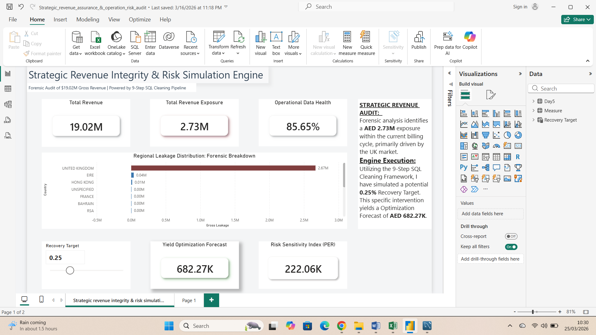
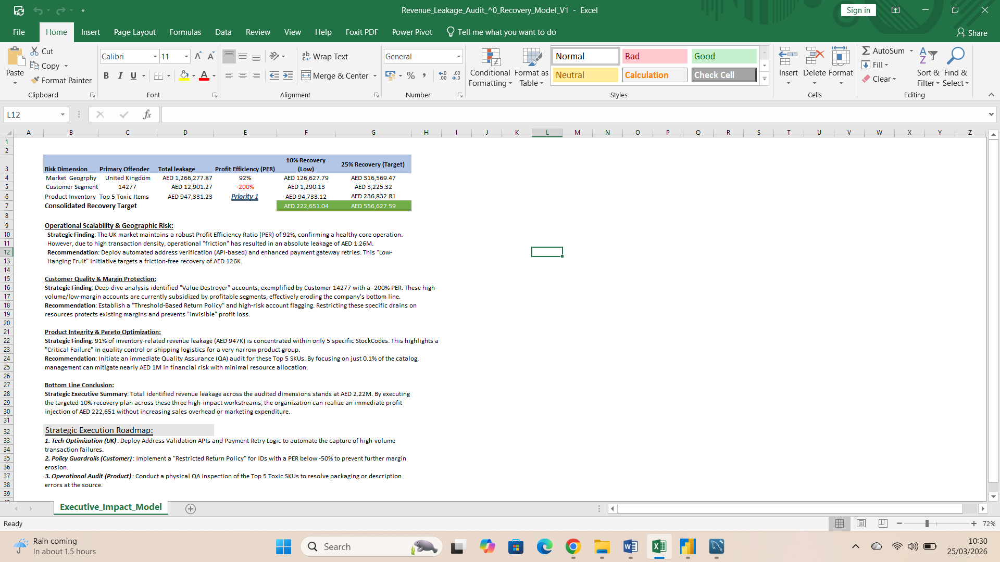

# Strategic Revenue Integrity & Risk Simulation Engine
**Project Architect:** Niranjan Raj Paudel  
**Domain:** Decision Intelligence | Revenue Assurance | Risk Modeling

---

## 1. Executive Summary
This project engineered a State-of-the-Art Decision Engine that performs a forensic audit on **AED 19.02M** of gross revenue. By applying a 9-step SQL cleaning pipeline and Excel-based scenario modeling, I identified **AED 2.73M** in "Revenue Leakage." The engine allows executives to simulate recovery targets—proving that even a modest 0.25% improvement in operational efficiency yields a forecast optimization of **AED 682.27K**.

---

## 2. The Tech Stack: Architecture of Integrity
* **Engine (SQL):** MySQL Server 9.5 – High-volume bulk loading and multi-layer data hardening (Bronze, Silver, Gold).
* **Forensic Validation (Excel):** Scenario Modeling and Pareto Analysis (The "91% Concentration" Rule).
* **Interface (Power BI):** Interactive Risk Simulation Dashboard with dynamic yield forecasting.

### 🖼️ Operational Risk & Revenue Intelligence Dashboard

### 🖼️ Strategic Executive Impact & Recovery Roadmap

---

## 3. Data Engineering: The 9-Step SQL Pipeline
To ensure data integrity, I built a three-layer infrastructure:

### Phase 1: Ingestion (Bronze Layer)
* **Bulk Loading:** Used `LOAD DATA INFILE` for high-speed ingestion of ~1.06M rows.
* **Infrastructure:** Initialized the `retail_intelligence` environment with strict schema definitions.

### Phase 2: Hardening (Silver to Gold)
* **Standardization:** Applied `TRIM/LOWER` and `COALESCE` for categorical consistency.
* **Temporal Repair:** Converted string dates into proper `DATETIME` objects.
* **Deduplication:** Utilized `DISTINCT` logic to resolve hardware-intensive duplicate events.
* **Repair Script:** Resolved primary key violations by aggregating split line items and fixed data truncation using `ROUND(AVG(Price), 2)`.

---

## 4. Excel Forensic Modeling: The Strategic Deep Dive
Before moving to Power BI, I utilized Excel to perform a Strategic Impact Analysis. This phase was critical for identifying the "Primary Risk Offenders."

**Key Findings & Recommendations:**
* **Geographic Risk:** Identified the UK market as the absolute leakage leader at **AED 1.26M**.
    * *Recommendation:* Deploy automated address verification (API-based) to reduce high-friction failures.
* **Customer Quality:** Isolated accounts exhibiting a **-200% PER**.
    * *Recommendation:* Implement a "Threshold-Based Return Policy" to stop invisible profit erosion.
* **Product Integrity:** Discovered that **91% of inventory leakage** is concentrated in only 5 specific StockCodes.
    * *Recommendation:* Conduct immediate Quality Assurance (QA) inspections on these Top 5 SKUs.

---

## 5. Risk Intelligence & The PER Framework
I developed the **Profit Efficiency Ratio (PER)** to quantify market health:

$$PER = \frac{\text{Gross Revenue} - \text{Revenue Leakage}}{\text{Gross Revenue}}$$

* **SQL PER:** Historical "Truth" (The static audit).
* **Power BI PER:** Future "Sensitivity" (The dynamic multiplier).

---

## 6. The Simulation Interface (Power BI)
The final dashboard serves as a Strategic Command Center:
* **Total Revenue Exposure (AED 2.73M):** The total financial "At-Risk" amount.
* **Operational Data Health (85.65%):** A forensic measure of system cleanliness.
* **Recovery Target (Slider):** Allows users to set a realistic intervention goal (e.g., 0.25%).
* **Yield Optimization Forecast:** Proves that a focused effort converts "Leakage" into "Cash Flow."

---

## 7. Project Conclusion
This project demonstrates that Decision Intelligence is built on a foundation of data integrity. By cleaning the "noise" in SQL, validating the "strategy" in Excel, and modeling the "signal" in Power BI, I have provided a blueprint for multi-million dollar revenue reclamation.

---
*Note: This project uses public retail data for modeling purposes. Financial values are simulated for business impact analysis.*
